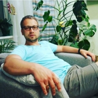

# **DMYTRO SYCHOV** 

\| *Odessa city, Odessa reg., Ukraine, 65123* \| Mob: *+380508736005* \| Email: *dmtr.schv@gmail.com* \|

## **About me** 



Higly reliable person with fifteen years of extensive experience in the maritime field, with proven performance in simple analysis, report writing, regulatory compliance and documentaion. CAD drafting professional with broad understanding of design and construction process with exceptional creativity, problem solving and interpersonal skills.

Consistently generate new ideas and concepts. Capable of planning ahead, setting priorities, delegating, making decisions and influencing people.

**First place** holder of the Mariupol city Wide Scientific and Technical conference in 2001 in **"Programming"** category.

Able to fast and easy learning of new things. Have extreme passion to studiing programming languages and becoming a web developer.

Although my previous experience is not connected to the target I am going to, I have got a lot of vital skills from the businesses I have been engaged in. The list of the prior positions is as follows:

| Time period | Company | Position | Major duties |
| :---------: | ------- | -------- | ------------ |
| 2018-2021 | Various | Seafarer / Watch Officer | Navigation, safety equipment maintenance |
| 2012-2018 | LERUS Limited | Technical director | Supervision, QMS, certification |
| 2006-2012 | SIGO Marine | Engineer inspector | Technical surveys, reporting |

## **Skills** 

1. Soft skills
   - `Active learnig`
   - `Ability to work in a team environment`
   - `Leadership`
   - `Creative problem solving`
   - `Expertise in troubleshooting`
   - `Critical thinking`

2. Tech skills
   - `HTML`
   - `CSS`
   - `Pure JavaScript`
   - `BEM metodology`
   - `SSAS / LESS`
   - `GIT`
   - `Github`

3. as well as additional technical skills
   - `AutoCAD, SOLIDWORKS confident user`
   - `Expert in 3D modelling and 3D Printing`
   - `Good mathematical skills`
   - `Competent in developing operation, technical manuals and other documentation`
   
## **Code sample** 

```
openModalBtns.forEach((item) => {
    item.addEventListener("click", (e) => {
      e.preventDefault();
      toggleModalWindow();
    });
  });
```

## **Coding experiene** 

I do not have any commercial coding experience.

## **Education** 

I have not got any special programming education except short free online webinars so far. Self learning is what I do for developing. As I stated above I had got the first place at the Mariupol city wide scientific and technical conference in 2001 in category "Programming" as a result of self learning (Delphi).

| Time period | Institute | Faculty |
| :---------: | --------- | ------- |
| 2001-2006 | Odessa State Maritime Academy | Navigation |
| 1998-2001 | Mariupol City Liceum | Phisics and mathematics |

## **English** 

**B1 Upper Intermediate** level proved by **[IELTS](https://www.ielts.org/)** Report. Oral and written communication
skills, along with superb reading comprehension. English practised wisely on the previous work places.

---

Tyler Perry said:
>Developing a good work ethics is key. Apply yourself at whatever you do, whether you're a janitor or taking your first summer job because that work ethics will be reflected in everything you do in life.     

The qoute is from: [https://www.wisesayings.com/work-quotes/#ixzz6lFC2n84V](https://www.wisesayings.com/work-quotes/#ixzz6lFC2n84V)
